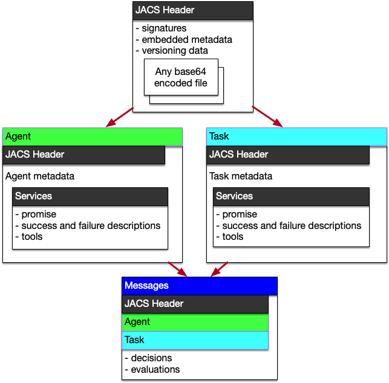

# JACS 

Welcome to JACS (JSON Agent Communication Standard), a verifiable document format for AI agents.

JACS documents enable more trusted data sharing between AI agents and Human UIs.

** NOTE: Current version 0.3.0 *ALPHA* .

JACS is a JSON document format for creating secure, verifiable documents that AI agents, ML pipelines, SaaS services, and UIs can exchange and process. The goal of JACS is to ensure that these documents remain unchanged (immutable), produce the same verification result every time (idempotent), and can be used flexibly by software.

With JACS, data can be securely stored or shared, and different versions of the data can be tracked. One of the key features of JACS is its ability to provide instant verification of document ownership. Each version of a JACS document is signed with a unique digital signature, allowing an AI agent to prove its data claims. This enables trusted interactions between agents and provides flexibility in how documents are versioned and exchanged. Any person or software can modify a doc, but only agents with the private key can sign new versions, and only holders of the public key can verify.

JACS also provides standardization for agreement between agents. While each document will only have been modified by one agent, any agent can create a new version. With a JACS document, one can guarantee that other agents agree to new versions is critical infrastructure for sharing tasks.

Use JACS as is, embed in other projects or libraries, commercial or otherwise.

## Basic use cases

  1. version json documents and test against a schema
  2. capture metadata about files and versions and securely verify
  3. sign documents
  4. create agreements between human and ai agents
  5. create agents and describe what they can do
  6. create tasks manage their state
  7. Use with [OpenAI structured ouput](https://openai.com/index/introducing-structured-outputs-in-the-api/)

## Documentation

 - [Usage Docs](https://humanassisted.github.io/JACS/)
 - [API docs](https://docs.rs/jacs/latest/jacs/)
 - [pypy]( #)
 - [Rust Crate](https://crates.io/crates/jacs)
 - [Schema docs](./schemas)
 - [example files](./examples)
 - [use case examples (wip)](https://github.com/HumanAssisted/jacs-examples)
 - [presentation on JACS](https://docs.google.com/presentation/d/18mO-tftG-9JnKd7rBtdipcX5t0dm4VfBPReKyWvrmXA/edit#slide=id.p)
 - [changelog](./CHANGELOG.md)

## extensible

Use any type of JSON document, and you can enforce structure of type of JSON document using
[JSON Schema](https://json-schema.org/). If you are just getting started with JSON schema

 1. [introduction](https://json-schema.org/understanding-json-schema)
 2. [github page](https://github.com/json-schema-org)
 3. [youtube channel](https://www.youtube.com/@JSONSchemaOrgOfficial)

JSON isn't the only document you can work with. You can embed any document, so if you want to sign a gif or .csv, you can link or embed that document with JACS.

## open source

In addition, JACS also depends on the work of great other open source efforts in standards and encryption.

See the [Cargo.toml](./Cargo.toml)

# Quick Start

To install the command line tool for creating and verifying agents and documents

    $ cargo install jacs
    $ jacs --help

If you are working in Rust, add the rust lib to your project

    cargo add jacs

For development you may want    `cargo install cargo-outdated` and `cargo install cargo-edit`

Then start reading the [usage docs](https://humanassisted.github.io/JACS/)

------
2024 https://hai.ai
