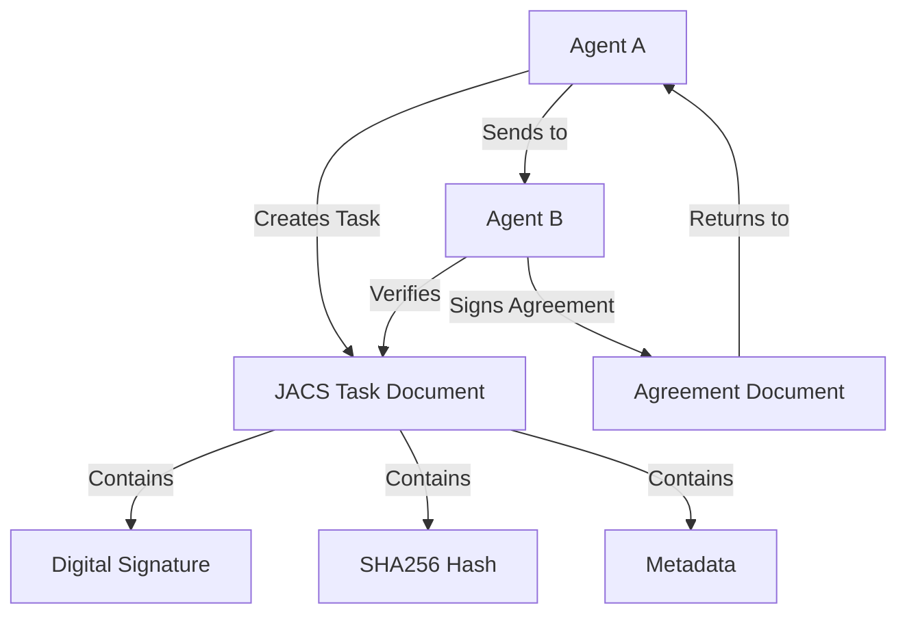

# What is JACS?

**JACS (JSON Agent Communication Standard)** is a comprehensive framework designed to solve a critical problem in AI systems: **How do agents communicate and collaborate securely with verifiable trust?**

## The Problem JACS Solves

As AI systems become more sophisticated, we're moving toward multi-agent architectures where different AI agents need to:

- **Exchange tasks** and delegate work to each other
- **Create agreements** and verify their completion
- **Share data** with guaranteed authenticity
- **Maintain audit trails** of decisions and actions
- **Establish trust** without centralized authorities

Traditional approaches fall short because they lack:
- Cryptographic integrity for agent communications
- Standardized formats for agent interactions
- Built-in versioning and audit trails
- Support for multi-agent agreements and workflows

## JACS Core Philosophy

### 🎯 **Agent-First Design**

JACS is built specifically for AI agent communication patterns, not as a general-purpose document signing system. It understands concepts like:
- **Agents** with identities and capabilities
- **Tasks** that can be delegated and tracked
- **Agreements** between multiple parties
- **Versioning** for iterative improvements

### 🔐 **Trust Through Cryptography**

Every JACS document includes:
- **Digital signatures** proving authenticity
- **Hash verification** ensuring integrity  
- **Public key cryptography** for identity verification
- **Timestamps** for chronological ordering

### 📋 **Standards-Based**

JACS builds on proven standards:
- **JSON** for universal compatibility
- **JSON Schema** for structure validation
- **RFC 3339** timestamps for consistency
- **Standard cryptographic algorithms** (RSA, Ed25519, post-quantum)

## Key Concepts

### Agents
An **Agent** is an autonomous entity with:
- A unique identity (UUID)
- Cryptographic keys for signing
- Capabilities defined in services
- The ability to create and verify documents

### Documents
A **Document** is any JSON object that includes:
- JACS header fields (ID, version, creator, etc.)
- A cryptographic signature
- A hash for integrity verification
- Business logic specific to the document type

### Tasks
A **Task** is a special document type representing:
- Work to be performed
- Success/failure criteria
- Input/output specifications
- Delegation and completion tracking

### Agreements
An **Agreement** is a mechanism for:
- Multiple agents to consent to terms
- Tracking signatures from all required parties
- Ensuring all participants have signed before proceeding
- Creating binding commitments between agents

## How JACS Works



1. **Agent A** creates a task document with their requirements
2. The document is **signed** with Agent A's private key
3. A **hash** is calculated for integrity verification
4. **Agent B** receives and verifies the signature and hash
5. Agent B can **create an agreement** to accept the task
6. Both agents have a **verifiable record** of the interaction

## Real-World Examples

### 🤖 **AI Content Pipeline**
```
Content Agent → Research Agent → Review Agent → Publishing Agent
```
Each handoff includes signed task documents with clear requirements and deliverables.

### 📊 **Data Processing Workflow**
```
Data Ingestion Agent → Processing Agent → Validation Agent → Storage Agent
```
Each step is tracked with verifiable completion certificates and quality metrics.

### 🔍 **Multi-Agent Analysis**
```
Query Agent → Research Agent → Analysis Agent → Reporting Agent
```
Complex analysis tasks are broken down with clear accountability for each step.

## Benefits Over Alternatives

| Feature | JACS | Traditional APIs | General Signing |
|---------|------|------------------|-----------------|
| **Agent Identity** | ✅ Built-in | ❌ Custom implementation | ❌ Not agent-focused |
| **Task Management** | ✅ Native support | ❌ Application-specific | ❌ Not applicable |
| **Multi-Party Agreements** | ✅ Core feature | ❌ Complex to implement | ⚠️ Possible but difficult |
| **Audit Trails** | ✅ Automatic | ❌ Manual logging | ⚠️ Basic signing only |
| **Schema Validation** | ✅ JSON Schema | ❌ Custom validation | ❌ No structure |
| **Versioning** | ✅ Built-in | ❌ Manual versioning | ❌ Not supported |
| **Cross-Platform** | ✅ JSON everywhere | ⚠️ Protocol dependent | ⚠️ Format dependent |

## When to Use JACS

✅ **Perfect for:**
- Multi-agent AI systems
- Task delegation and tracking
- Audit trail requirements
- Cross-organization AI collaboration
- Compliance-critical AI applications
- Research environments with multiple AI models

⚠️ **Consider alternatives for:**
- Simple single-agent systems
- Real-time streaming data
- High-frequency micro-transactions
- Systems where trust is not a concern

## Next Steps

Ready to dive deeper? Continue with:
- **[Core Concepts](concepts.md)** - Learn about agents, documents, and agreements
- **[Quick Start](quick-start.md)** - Get hands-on experience
- **Implementation guides** for [Rust](../rust/installation.md), [Node.js](../nodejs/installation.md), or [Python](../python/installation.md) 