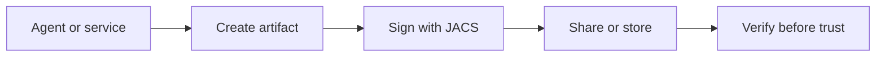

# What is JACS?

JACS is a cryptographic provenance layer for AI agents and the artifacts they produce. It gives an agent a persistent signing identity, wraps important outputs in tamper-evident signatures, and lets other systems verify origin and integrity later.

Use JACS when data crosses a trust boundary: another service, another agent, another organization, a user-facing audit trail, or a file that must remain verifiable after it leaves the process that created it.

## The Problem

Agent systems increasingly produce artifacts that other systems act on:

- JSON tool results, reports, memories, and configs
- Markdown plans, design docs, and release notes
- Images, screenshots, charts, and generated media
- Email messages and attachments
- A2A artifacts, MCP tool calls, and multi-agent approvals

Logs can say what happened, but they are usually controlled by the same system that produced the data. JACS attaches proof to the artifact itself.

## Core Ideas

| Concept | Meaning |
|---------|---------|
| **Agent** | A named identity with signing keys and metadata. |
| **Signed document** | A JSON envelope with payload, hash, signer metadata, and signature. |
| **Artifact signature** | A JACS signature attached to non-JSON content, such as text, images, or email. |
| **Trust store** | Local public keys and trust decisions used during verification. |
| **Agreement** | A signed multi-party approval with quorum, timeout, and algorithm constraints. |

## What Verification Proves

Verification answers two practical questions:

1. Did the signer with this public key sign these canonical bytes?
2. Has the signed content changed since it was signed?

Verification does not prove first creation, copyright ownership, human authorship, or that a real-world statement is true. It gives you cryptographic accountability for the artifact.

## Where JACS Fits

```mermaid
flowchart LR
    A["Agent or service"] --> B["Create artifact"]
    B --> C["Sign with JACS"]
    C --> D["Share or store"]
    D --> E["Verify before trust"]
```

JACS does not replace your application protocol. It works with CLI jobs, Rust services, Python and Node frameworks, MCP tools, A2A exchange, and file-based workflows.

## When To Use It

- A downstream system should verify who produced an artifact.
- Multiple agents or teams need an auditable handoff.
- A document, image, or email must stay verifiable outside your database.
- You need open source signing primitives without a mandatory central registry.

## When Not To Use It

- Everything stays inside one trusted process and logs are enough.
- You only need accidental-corruption detection.
- There is no signer identity or audit requirement.

## Next Steps

- [Quick Start](quick-start.md)
- [Which Integration?](decision-tree.md)
- [Use Cases](../usecases.md)
